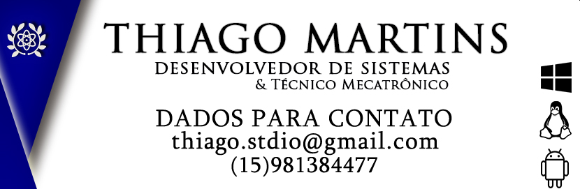

# Olá, meu nome é [Thiago Martins](https://thiagostdio.github.io/site) 

## Seja Bem-Vindo ao meu perfil no GitHub :anchor:

<details>
  
  <summary>:zap: Meu Status</summary>

  
  
</details>

<details>
  
  <summary>:zap: Minhas ferramentas e idiomas</summary>


  
</details>

<br/>

---

# Projetos Contidos Aqui

## Repositório:

 Arduino

```sh
TAG: PROJETO - A ("A" REFERENTE AO ARDUINO) (NÚMERO DO PROJETO) - NOME DO PROJETO
```

:closed_book: Exercicios Desenvolvidos

```sh
TAG: ORDEM DO PROJETO - CLASSIFICAÇÃO - NOME DO EXERCICIO - FACULDADE DO EXERCICIO
```

:orange_book: Projetos Desenvolvidos:

```sh
TAG: PROJETO - ID (NÚMERO DO PROJETO) - NOME DO PROJETO
```

---

## Documentação dos projetos

:page_facing_up: Descrição:

```sh
Descrição dos projetos desenvolvidos, aqui eu incluo algumas informações para descrever o projeto.
```
---

<!-- ## Versionamento do Projeto
:pushpin: * Versionamento dos documentos
-->

# Cartão Visita




## Me adicione nas redes sociais e de um toque para mim, amo fazer amigos, e o'que eu puder contribuir estarei a disposição.

### <div align="center">Desenvolvedor de Sistemas Jr Thiago Carvalho Martins</div>


[Instagram](https://www.instagram.com/thiagostdio/)

[LinkedIn](https://www.linkedin.com/in/thiago-c-621365175/)

[Facebook](https://www.facebook.com/password.iso.27001/)

[Github](https://www.instagram.com/thiagostdio/)

[WhatsApp](https://api.whatsapp.com/send?phone=5515981384477&text=Ol%C3%A1)

---


<!-- Markdown link & img dfn's -->
[XAMARIN]: https://img.shields.io/badge/XAMARIN-TRUE-white
[Teste de usabilidade]: https://img.shields.io/badge/TestedeUsabilidade-OK-black
[DOWNLOADS]: https://img.shields.io/badge/Downloads-X-cyan
[JAVA]: https://img.shields.io/badge/JAVA-TRUE-pink
[CSS]: https://img.shields.io/badge/CSS-TRUE-green
[HTML]: https://img.shields.io/badge/HTML-TRUE-blue
[PHP]: https://img.shields.io/badge/PHP-TRUE-red
[FP]: https://img.shields.io/badge/FernandoPrestes-FLAG-yellow
[ARDUINO]: https://img.shields.io/badge/Arduino-UNO-yellowgreen
[CS]: https://img.shields.io/badge/C-Sharp-cyan
[SQL]: https://img.shields.io/badge/SQL-TRUE-red
[JS]: https://img.shields.io/badge/Java-Script-red
[TCC]: https://img.shields.io/badge/TCC-FP-green
[TCCF]: https://img.shields.io/badge/TCC-IFSP-green
[IFSP]: https://img.shields.io/badge/IFSP-Flag-green
[THIAGO]: https://img.shields.io/badge/THIAGO-MARTINS-Flag-green
[CEL]: https://img.shields.io/badge/(15)-981384477-Flag-blue

<!-- :construction:
Emojis [https://gist.github.com/rxaviers/7360908] 
BadgesOnline [https://github.com/Ileriayo/markdown-badges] 
Icones [https://simpleicons.org/] 
Badges [https://shields.io/]
-->
